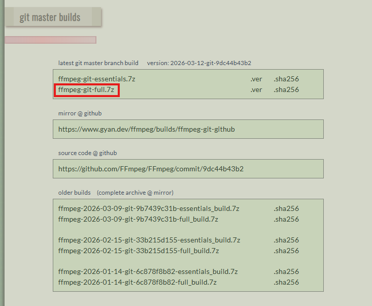
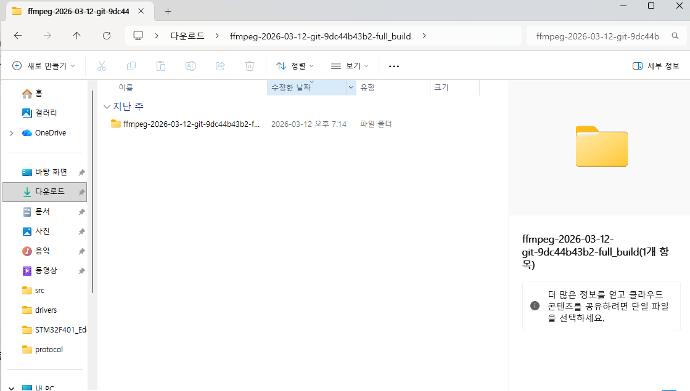
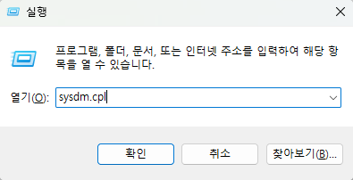
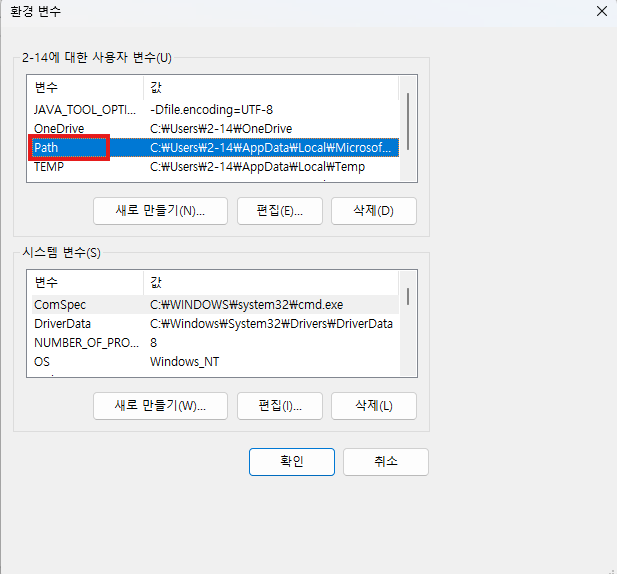
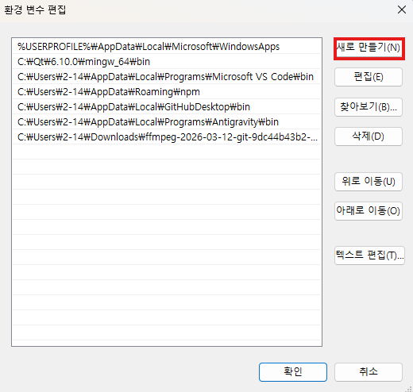
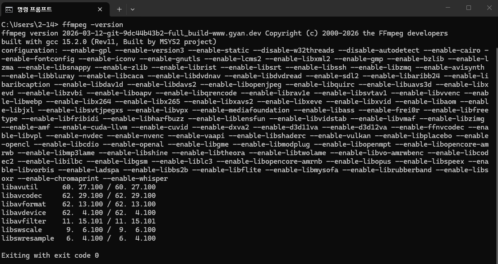

# 클라이언트 설정 가이드

---

# 1. server.crt 설정

Qt 클라이언트는 서버와 TLS 암호화 통신을 합니다. 서버 인증서 파일이 `src/config/server.crt`에 있어야 합니다.

서버 담당자로부터 `server.crt` 파일을 받아 아래 경로에 넣습니다.

```
client/src/config/server.crt
```

> 인증서가 없거나 서버 IP와 불일치하면 접속이 거부됩니다.

---

# 2. FFmpeg 설치 가이드

Qt 클라이언트에서 영상 녹화 기능을 사용하려면 FFmpeg이 설치되어 있어야 합니다.

---

## 2-1. 다운로드

아래 주소로 이동합니다.

```
https://www.gyan.dev/ffmpeg/builds/
```

페이지에서 **`ffmpeg-git-full.7z`** 를 클릭하여 다운로드합니다.



---

## 2-2. 압축 풀기

다운로드한 `.7z` 파일을 임의의 위치에 압축 해제합니다.



---

## 2-3. 환경 변수 설정

### 3-1. 환경 변수 창 열기

`Win + R` 을 눌러 실행 창을 열고 `sysdm.cpl` 을 입력한 후 확인을 클릭합니다.
이후 **[고급]** 탭 클릭 → **[환경 변수]** 클릭합니다.



### 3-2. Path 편집

**[사용자 변수]** 목록에서 **`Path`** 를 더블 클릭합니다.



### 3-3. 새 경로 추가

**[새로 만들기]** 를 클릭한 후, 압축을 푼 폴더 안의 **`bin`** 경로를 입력합니다.

예시:
```
C:\Users\사용자명\Downloads\ffmpeg-2026-03-12-git-9dc44b43b2-full_build\bin
```



경로 입력 후 **확인**을 눌러 저장합니다.

---

## 2-4. 설치 확인

CMD 창을 열고 아래 명령어를 입력하여 정상적으로 설치되었는지 확인합니다.

```bash
ffmpeg -version
```



버전 정보가 출력되면 설치가 완료된 것입니다.
